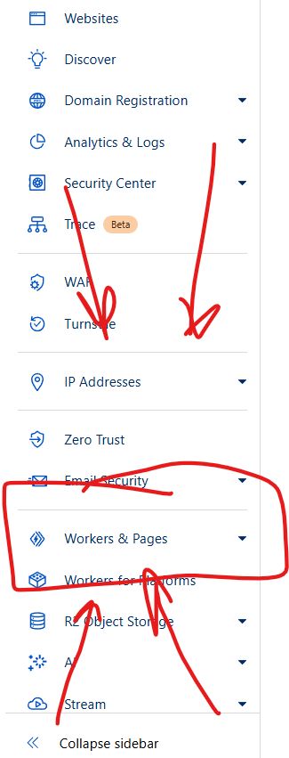
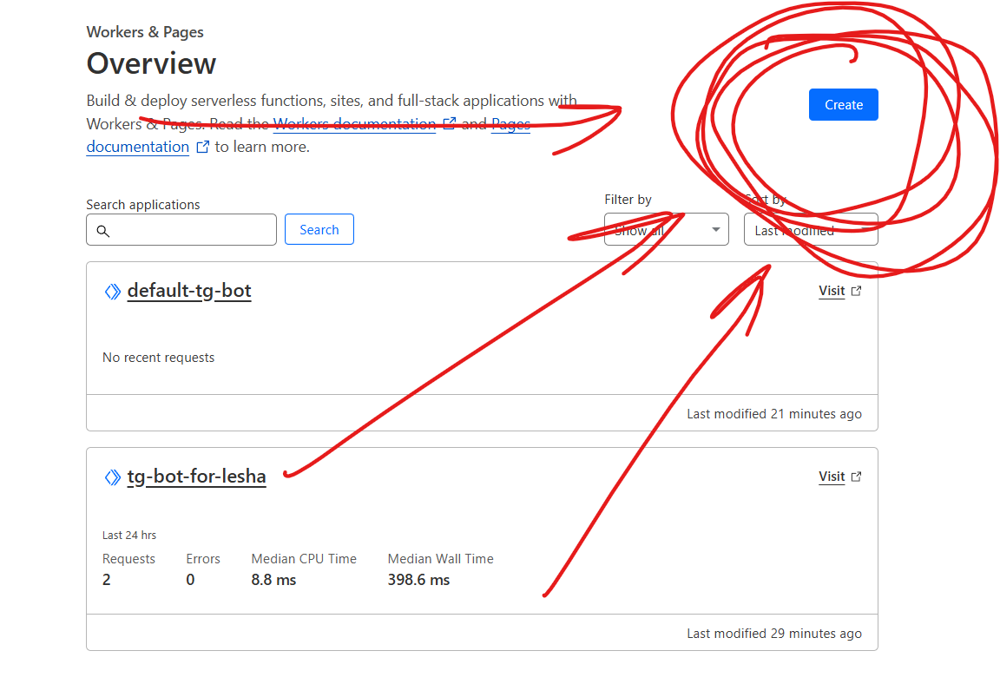
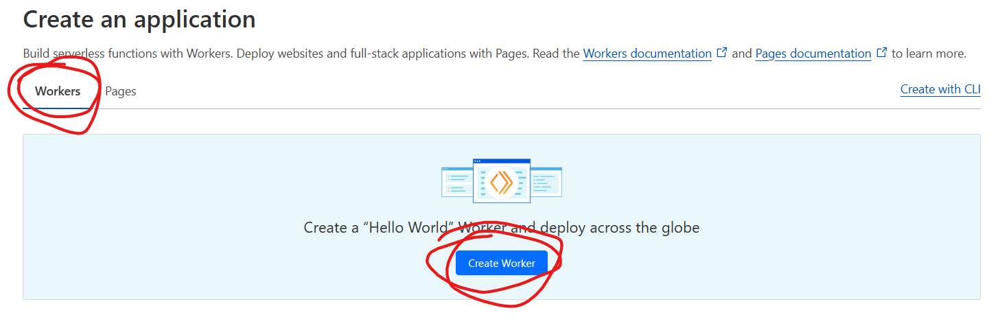
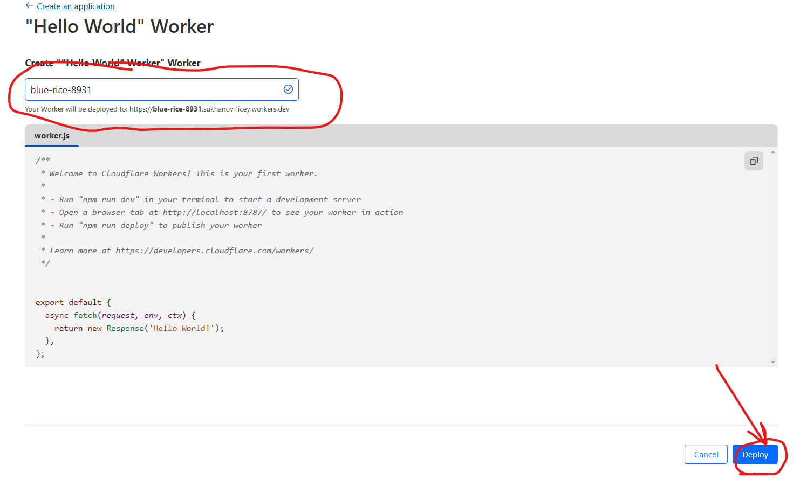
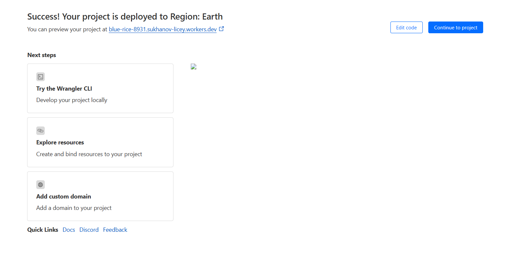
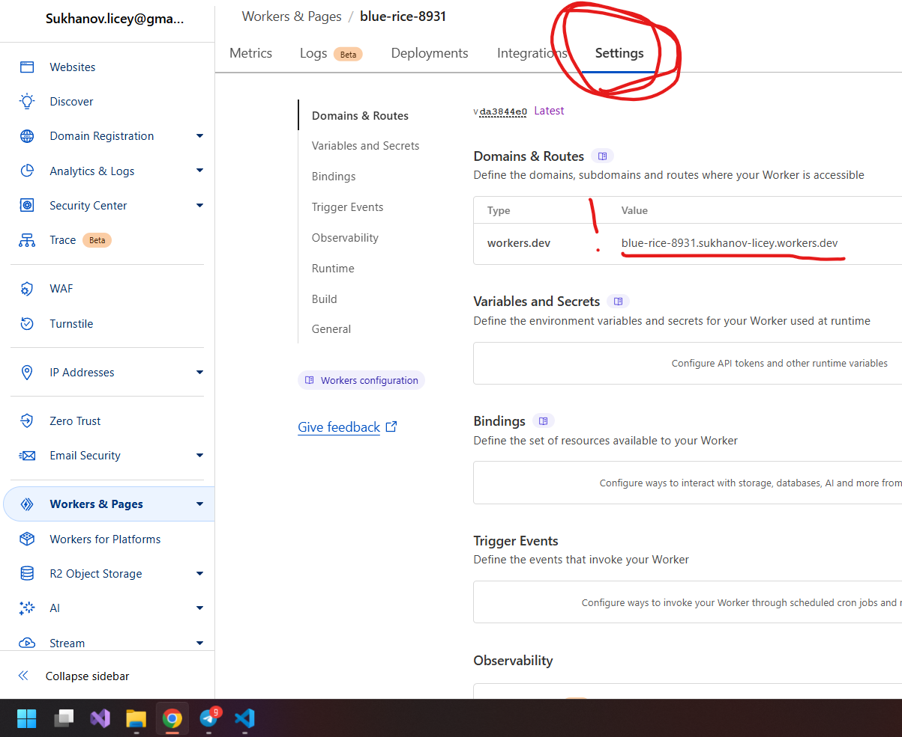

# Запуск бота и заливка его на сервер

Инструкция написана 02.11.2024

Все оказывается проще, чем оказывается

1. [Регистрация бота!](#регистрация-tg-бота)
1. [Создание аккаунта на CloudFlare](#cloudflare)
1. [Создание worker. Да работника](#создание-worker) 
1. [Скачивание пустого проекта](#пустой-проект)
1. [Скачиваем и проверяем библиотеки](#скачиваем-и-проверяем-библиотеки)
1. [Заполнение нужных... эээ... штучек)))](#заполняем-пропуски)
1. [Давай запускай уже!](#давай-запускай-уже)


## Регистрация tg-бота

Для того, чтобы зарегистрировать tg-бота нужно зайти в tg-бот под названием [BotFather](https://t.me/BotFather). В нем нужно нажать на кнопку меню и нажать на `/newbot` (Или вбить эту команду вручную). После этого нужно придумать ему название как бы для себя, оно может быть любым. И еще одно название для всех, которое могут видеть другие пользователи (может быть занято=)

[Наверх](#запуск-бота-и-заливка-его-на-сервер)

## CloudFlare

CloudFlare - это платформа, которая позволит нам залить готового бота на сервер, чтобы он постоянно работал. Для этого перейдем на их [сайт](https://www.cloudflare.com) и зарегистрируемся на нем. После успешной регистрации он должен нас кинуть на dashboard.

[Наверх](#запуск-бота-и-заливка-его-на-сервер)

## Создание worker

В дашборде cloudflare слева мы можем найти и кликнуть пункт `workers & pages`


---

Мы попадаем на страницу где будут отображаться наши `workers` и `pages`. Но пока что список должен быть пустой. Тогда создадим нового "работника", нажав на кнопочку `create`


---

Далее он просит нас выбрать что именно будет создавать


---

И мы вновь попадаем непойми куда. Он нам хочет показать как будет выглядеть стандартный воркер. Но нам нужно заполнить название воркера и нажать на кнопочку `deploy`


---

И в итоге должен получится что-то вроде такого


---

Дело осталось за малым! Теперь вернемся к `Workers & Pages` и найдем в списке только что созданного работника. Перейдем к нему и обнаружим еще кучу непонятно чего. Но нам все это совсем не нужно. А нужно нам перейти во вкладку `settings` и в них мы найдем адрес нашего работника, к которому мы дальше будем привязывать tg-бота.

Эту страничку мы пока закрывать не будем и не будем про нее забывать, авось пригодится



[Наверх](#запуск-бота-и-заливка-его-на-сервер)

## Пустой проект

Бота создали, воркера (будущий сервер) сделали. А где сам бот? Где кнопочки ссылочки? Чо такое вообще.

Теперь нам нужно скачать готовый проект с ботом уровня "я родился", чтобы объединить наши предыдущие усилия и закончить уже с этим дурацким конфигурированием.

Скачиваем проект по эээ... вот [этого](https://github.com/ProfAndroid2020/default-tg-bot/settings) git-репозитория. Но если ты уже тут, то нужно просто скачать при помощи инструментов git или скачать архив, нажав на кнопочку `code` и `download zip`. Все это дело нужно будет положить куда нибудь в папочку на компьютере и уже там внутри мы будем работать.

[Наверх](#запуск-бота-и-заливка-его-на-сервер)

## Скачиваем и проверяем библиотеки

Для начала откроем наш проект в visual studio code. Есть разные способы это сделать но мы можем просто найти нашу папку в проводнике, кликнуть правой кнопкой и нажать `открыть с помощью Code`.

Далее нужно установить зависимости, которые прописаны в настройках проекта. Для этого перейдем в терминал (`ctrl+~`), и в терминале пропишем `npm i` для того чтобы установились (install) библиотеки

Одной из этих библиотек является `wrangler` - это библиотека, которая позволяет нам работать с сервисом cloudFlare. С ее помощью мы будем заливать наше приложение на воркер-сервер. Но для начала нужно залогиниться.

Вбиваем в консоли команду `npx wrangler login` и нас выкидывает в браузер, где нужно подтвердить авторизацию. После подтверждения браузер можно закрыть и вернуться в консоль.

Для того, чтобы проверить авторизацию, нужно выполнить команду `npx wrangler whoami` (ху эм ай, да). И консоль должна выдать вам вашу же почту, под которой вы регистрировались в cloudflare.

Похоже что почти все готово!

[Наверх](#запуск-бота-и-заливка-его-на-сервер)

## Заполняем пропуски

Для того, чтобы проект понимал куда заливать бота, как телеграм поймет что куда и как, нам нужно заполнить пару мест своими данными.

Чтобы не искать их тут и там, нужно:

1. Находясь в visual studio code (vsc) нажать `ctrl+shift+F` и мы попадаем в глобальный поиск по проекту
1. Вбиваем в поле Поиск ровно это сочетание символов `<ЗАПОЛНИТЬ`. Не забываем, что vsc найдет это сочетание символов и в файле с инструкцией!
1. vsc должен найти ровно пять мест с таким запросом, одно из которых будет здесь, в файле README.
1. В каждом найденном месте написано, что туда нужно поместить. Например, если токен нашего бота 1245asdf, то строчку 
``` typescript
const BOT_TOKEN = '<ЗАПОЛНИТЬ: токен бота>';
```

нужно будет заменить на 

``` typescript
const BOT_TOKEN = '1245asdf';
```

И так нужно будет пройтись по всем пропускам

[Наверх](#запуск-бота-и-заливка-его-на-сервер)

## Давай запускай уже!

Все все, уже почти все сделали! Запустить мы можем уже сейчас, только вопрос, а что он делать то будет. So зайдем в файл `src/main.ts`. Здесь прописан функционал нашего бота. И на данный момент он только создаст в меню бота кнопку `start` и отправит сообщение пользователю `Бот запущен`. Вот и все однако этого уже достаточно чтобы его проверить!

### Запуск бота локально для разработки

Для этого нужно всего лишь нажать клавишу `f5` и полетели в консоли будут какие то странные надписи от `nodemon`, а в конце будет надпись о том, что бот запущен локально. При таком запуске бота его можно дебажить.

Несмотря на то, что бот запущен локально им уже можно пользоваться с любого устройства. До тех пор, пока запущен, конечно же

### Заливка бота на сервер

Если в режиме разработки бот ведет себя хорошо, то пора заливать его на сервер! Для этого нужно перейти в терминал и прописать ему команду `npm run deploy`. После этого wrangler начнет своё колдунство и "задеплоит" бота к себе на сервер, на воркер.

Дальше запустится команда, которая свяжет токен tg-bota с воркером на сервере. В консоли можно будет увидеть сообщение о том, что Webhook был установлен. Нууу или что-то вроде того.

Поздравляю! Ваш бот готов, вы великолепны!!!

[Наверх](#запуск-бота-и-заливка-его-на-сервер)